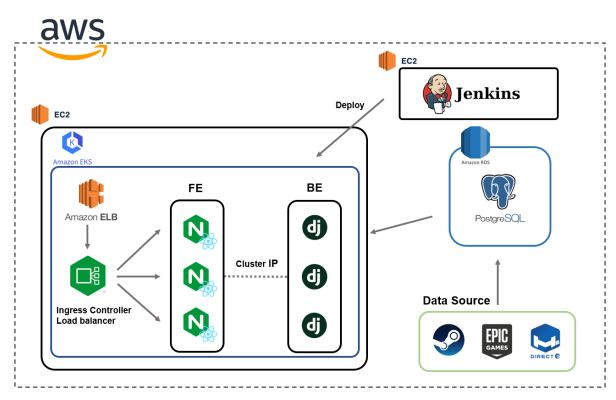

# p2p k8s
p2p k8s의 yaml 파일을 저장하는 repository입니다.
AWS EKS 상에 인프라를 구축하는 것을 전제로 만들어졌으나 로컬 K8S에서의 사용도 가능합니다.

## Version
- k8s: 1.22
- alb controller: 2.4.2 

## Infra Structure

- 시스템은 AWS EC2 인스턴스 3개와 RDS DB로 구성됩니다.
- EKS로 인스턴스 2개를 묶은 Kubernetes Cluster를 구성하고, 내부는 2개의 노드로
이루어집니다.
- ELB(ALB : application load balancer)로 L7 로드밸런서를 구성했고, HTTPS를 등록해
HTTP요청도 HTTPS연결으로 자동 redirect 됩니다.
- Nginx로 배포된 react앱과 Django앱을 REST API형태로(JSON 타입) 연동하여 통신
한다. 이때 Cluster IP를 사용해 백엔드 서버로 로드밸런싱합니다.
- 백엔드, 프론트엔드 코드가 깃에 커밋되면 웹훅을 통해 ec2의 젠킨스 서버로 알림이 가 도커 이미지 빌드와 쿠버네티스 배포가 수행되는 젠킨스 파이프라인이 트리거됩니다. 

### Pod
[POD](pod)
- 백엔드 Django의 데이터베이스 마이그레이션을 위해 마이그레이트 작업을 수행하는 파드를 구성했습니다. 마이그레이트 Job을 마치면 파드는 종료됩니다.

### Deployment
[Deployment](deployment)
- FE와 BE 모두 상태가 없기 때문에 디플로이먼트로 구성됩니다.
- FE에는 같은 FE끼리 안티 어피니티를 적용하여 같은 노드에 중복 생성되지 않게 하였습니다.
- BE는 어피니티를 적용하여 FE 파드가 생성된 곳에 같이 생성하여 통신 오버헤드를 줄일 수 있게 하였습니다.
- 롤링 업데이트를 적용하여 가용성을 향상시켰습니다.

### Configmap & Secret
- 개발 환경과 운영 환경의 분리와 환경변수를 통제할 수 있게 컨피그맵과 시크릿을 사용했습니다.
- django 시크릿키나 데이터베이스 암호 등은 암호화하여 시크릿을 사용하였고 gitignore에 추가하여 보안에 신경을 썼습니다.

###  Service & Ingress
- 클라이언트가 보내는 요청을 로드밸런싱 할 수 있도록 AWS ALB를 사용하였고 이와 연결을 위해 Ingress의 ALB 컨트롤러를 구축하였습니다.
- 기본적으로 운영환경에서는 오버헤드를 줄이기 위해 FE와 BE 사이에 클러스터 IP 서비스만을 구축하지만 개발환경에서는 API 테스트를 위해 BE에 연결되는 로드밸런서도 별도로 구성했습니다.
